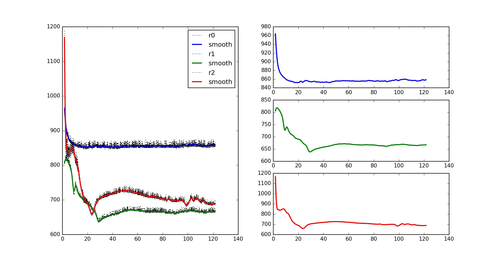
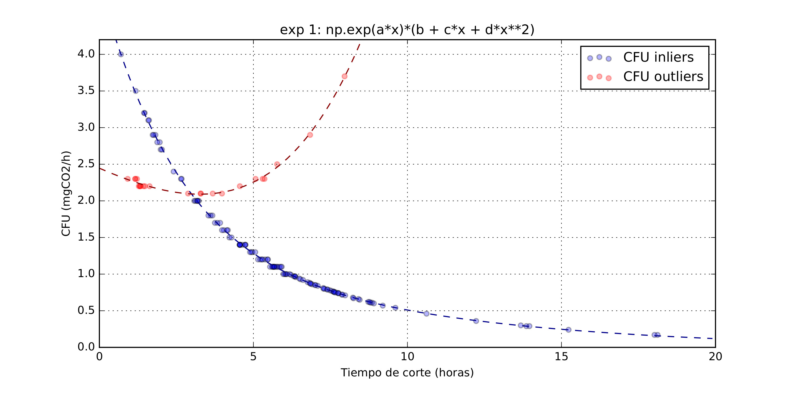

Some of my projects
================
Ismael Medina

*Literary Braids*
=================

*Literary Braids* was my first personal project, and probably the most beautiful to this date. The core idea was to design a computer program that would identify character interactions in a literary work and then represent them in a visual way. Literary braids would see characters as strings in time, braiding them together whenever they interact. The output is this beautiful pattern:

 You can see more braids and related graphs at [*Literary Braids*](literarybraids.com).

*My Study Plan*
===============

My last personal project is called *My Study Plan* and it is a free website that helps students making their own study calendar for their exams, taking into account the difficulty of their subjects and their availability of time. Since its launch more than two hundred people have visited [*My Study Plan*](mystudyplan.website) to get theirs. The output is something of this kind:

**INSERTAR IMAGENES**

UCM's Microbiology Department
=============================

In september 2016 I started collaborating with Mª Ángeles Gómez Flechoso (Biomathematics) and Alejandro García Conde (Microbiology) at UCM’s Faculty of Biology. I contacted them due to my great interest in the application of mathematics models to biological systems and I wondered if I could learn about this while taking part in current research. They proposed me to program an Arduino to measure CO2 production of samples of microorganisms, as a simple to build, cheap and free alternative to industrial impedance analysers such as Bactrac. My tasks involved:

-   Designing the electrical circuit for measuring impedance in the vials.
-   Programming the software for data retrieval and analysis. This, as it turned out, involved smoothing algorithms.

-   Understanding the fundamentals of how Bactrac’s device does analyse data. This required being able to design test functions flexible enough to fit different trends of data:

We are currently writing a paper in which we describe how to reproduce our system, so that everyone who needs it (inside or outside academia) can build their own CO2 production analyser.

Voronoi map using Madrid's Metro station as nodes
=================================================

I also dedicate some of my time to more simple projects, which nevertheless can produce interesting outputs. For example, this is Voronoi plot of Madrid, in which the nodes are the Metro stations.

